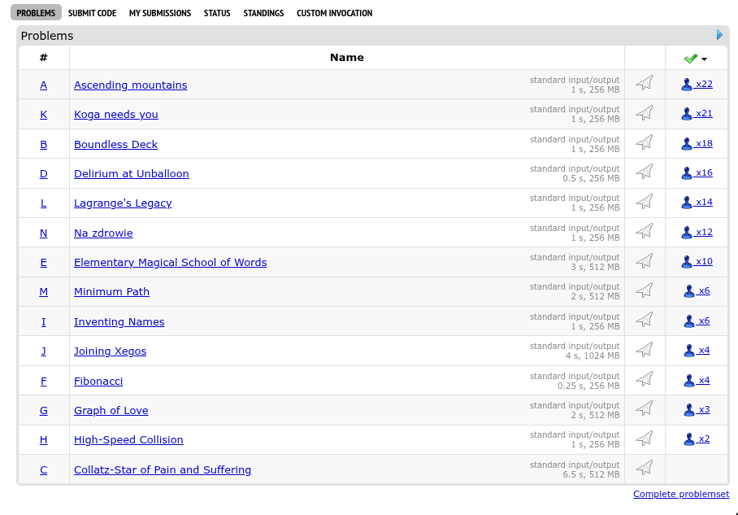

# 📚 SortSolved - Chrome Extension

**SortSolved** is a simple and powerful Chrome extension that allows users to sort solved problems on supported platforms for easier tracking and navigation.

---

## 🔧 Installation Instructions

Follow these steps to install the extension on your Chrome browser:

### 1. Download and Extract

- [Click here to download the ZIP file](https://github.com/Rnishu/SortSolved/releases/download/initial_release/SortSolved.zip)
- Unzip the downloaded file to a convenient location on your computer.

### 2. Load Extension in Chrome

1. Open Chrome and go to [`chrome://extensions`](chrome://extensions)
2. Enable **Developer Mode** using the toggle in the top right corner.
3. Click on **Load unpacked**.
4. Select the folder where you extracted the contents of the ZIP.

You're done! The extension should now be active in your browser.

---

## 🖼️ Demo

### 📌 Installation Tutorial/Extension in Action

[🎬 Watch demo video](images/demo.mp4)

## 💡 Features

- Simple extension as Gym contests with many problems are sometimes hard to read through

---

## ❓ FAQ

### Will this extension work on other browsers?

- The extension works for chromium based browsers, so will work with Brave, Sidekick etc.

---

## 📬 Feedback or Issues?

- Open a GitHub issue or contact me directly to report bugs or suggest features.

---

